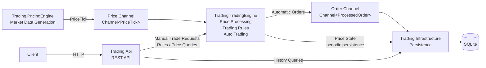

# Trading Pricing Engine & Trading Rules Service

## Overview

This project is a .NET 10 modular monolith implementing:

- concurrent market-price generation for multiple symbols
- market-price calculations and in-memory latest/previous state
- spread-based automatic trading
- configurable trading rules
- manual and automatic order validation
- SQLite persistence with EF Core
- runtime REST API for trades, orders, prices, and trading rules

## Technology Stack

- .NET 10
- ASP.NET Core
- Entity Framework Core
- SQLite
- System.Threading.Channels
- Mapster
- Scalar API Reference

## How to Run

### Prerequisites

- .NET 10 SDK

### Run

```bash
dotnet restore
dotnet build
dotnet run --project Trading.Api
```

The API listens on `http://localhost:5077`.

When running in the Development environment, interactive API documentation is available through Scalar at:

```text
http://localhost:5077/scalar
```

Pending EF Core migrations are applied automatically on startup. The SQLite database is created automatically if it does not exist, and no separate SQLite installation is required.

## Configuration

Auto-trading settings are configured in `Trading.Api/appsettings.json`.

Example:

```json
"AutoTrading": {
  "SpreadPercentThreshold": 0.02,
  "Quantity": 100
}
```

Pricing-engine settings such as configured symbols and tick interval use `PricingOptions` defaults and can be overridden through application configuration.

Trading rules are runtime state rather than static application settings. They are read through `GET /api/trading-rules`, updated through `PUT /api/trading-rules`, and persisted as versioned rows so the latest rules can be restored on startup.

## Solution Structure

```text
Trading.PricingEngine
    ↓
Trading.TradingEngine
    ↓
Trading.Infrastructure
    ↓
Trading.Api
```

Dependency direction:

```text
Trading.PricingEngine
    → no project dependencies

Trading.TradingEngine
    → Trading.PricingEngine

Trading.Infrastructure
    → Trading.TradingEngine

Trading.Api
    → composition root
```

### Trading.PricingEngine

Responsible for simulated market-price generation, concurrent async producer loops, tick validation, and publishing through a bounded channel.

### Trading.TradingEngine

Responsible for market-price calculations, price state, auto trading, trading-rule evaluation, immutable/versioned rule snapshots, and order processing.

### Trading.Infrastructure

Responsible for EF Core, SQLite, migrations, repositories, persistence services, and background persistence workers.

### Trading.Api

Acts as the composition root and owns DI registration, configuration binding, channel creation, database migration startup, state restoration, and REST endpoints.

## Architecture Diagram



The Pricing Engine and Trading Engine are decoupled through a bounded `Channel<PriceTick>`. Automatic orders are passed to persistence through a second bounded `Channel<ProcessedOrder>`.

Both channels use `FullMode = Wait`, providing backpressure and preventing unbounded memory growth. Manual trade requests use the same trading logic, but are persisted synchronously so the API can return a definitive durable result.

## Architecture & Design Decisions

I chose a modular monolith because the assignment has several clearly separated responsibilities, but does not require independent deployment or distributed infrastructure.

The four-project split keeps those responsibilities isolated while preserving a simple runtime model:

```text
Trading.PricingEngine
    ↓
Trading.TradingEngine
    ↓
Trading.Infrastructure
    ↓
Trading.Api
```

### Why a Modular Monolith

A microservice-based solution would introduce deployment, transport, configuration, and operational complexity that is unnecessary for this take-home.

The modular-monolith approach keeps clear boundaries between market-data generation, trading logic, persistence, and HTTP concerns while remaining easy to build, run, and review.

### Pricing Engine Isolation

`Trading.PricingEngine` owns simulated market-data generation and validation.

It has no persistence or API responsibilities. This keeps the producer independent from trading decisions and makes the market-data source replaceable without changing the trading logic.

### Trading Logic Isolated from Infrastructure

`Trading.TradingEngine` contains the core business behavior:

- market-price calculations
- latest/previous price state
- auto-trading decisions
- order processing
- trading-rule evaluation

It does not depend on EF Core or ASP.NET Core. This keeps the decision-making code independent from database and HTTP concerns.

### Infrastructure as the Persistence Boundary

`Trading.Infrastructure` owns SQLite, EF Core, repositories, persistence services, and persistence workers.

The trading engine depends on abstractions where persistence is required, while database-specific implementation details remain outside the business logic.

### API as Composition Root

`Trading.Api` is intentionally thin.

It wires the application together, hosts the background services, and exposes REST endpoints, but does not contain trading rules or persistence logic.

### Why Channels

Bounded `.NET Channels` provide an asynchronous boundary between producers and consumers with backpressure and bounded memory usage.

This keeps the market-data path decoupled without introducing an external broker for a single-process take-home solution.

### Why No MediatR / CQRS / Generic Repository

I deliberately avoided adding abstractions that were not required by the problem.

For this scope, direct service and repository calls keep the control flow obvious and reduce unnecessary indirection while still preserving clear project boundaries.

## REST API

| Method | Endpoint | Description |
|---|---|---|
| POST | `/api/trade-requests` | Submit a manual trade request |
| GET | `/api/trade-requests` | Get manual trade-request history |
| GET | `/api/orders/{symbol}` | Get order history by symbol |
| GET | `/api/trading-rules` | Get current trading rules |
| PUT | `/api/trading-rules` | Update trading rules |
| GET | `/api/prices/{symbol}` | Get latest market price |

### POST `/api/trade-requests`

Request:

```json
{
  "orderId": "8a1822d5-79fa-41ea-a2cb-e8bb7aa46d9f",
  "symbol": "AAPL",
  "side": 0,
  "price": 210.15,
  "quantity": 10
}
```

Response:

```json
{
  "orderId": "8a1822d5-79fa-41ea-a2cb-e8bb7aa46d9f",
  "symbol": "AAPL",
  "side": 0,
  "price": 210.15,
  "quantity": 10,
  "source": 0,
  "timestamp": "2026-09-06T19:10:00Z",
  "decisionStatus": 0,
  "rulesVersion": 3,
  "rejectionReasons": []
}
```

### PUT `/api/trading-rules`

Request:

```json
{
  "maxNotional": 1500000,
  "maxQuantity": 15000,
  "priceDeviationPercent": 1.0,
  "duplicateIdPreventionEnabled": true,
  "symbolWhitelistEnabled": true,
  "symbolWhitelist": ["AAPL", "MSFT"]
}
```

Response:

```json
{
  "version": 4,
  "maxNotional": 1500000,
  "maxQuantity": 15000,
  "priceDeviationPercent": 1.0,
  "duplicateIdPreventionEnabled": true,
  "symbolWhitelistEnabled": true,
  "symbolWhitelist": ["AAPL", "MSFT"]
}
```

### GET `/api/prices/AAPL`

Response:

```json
{
  "symbol": "AAPL",
  "bidPrice": 210.10,
  "askPrice": 210.20,
  "currentMarketPrice": 210.15,
  "spread": 0.10,
  "spreadPercent": 0.047585,
  "timestamp": "2026-09-06T19:10:00Z"
}
```

`GET /api/trade-requests` supports `symbol`, `status`, `from`, `to`, and `limit`.

`GET /api/orders/{symbol}` returns both Manual and Automatic orders.

`GET /api/prices/{symbol}` is served directly from the live in-memory `PriceStateStore` and does not query SQLite. Trade-request and order history are read from SQLite. Unknown symbols return `404`.

## Component Communication

The system uses two bounded `.NET Channels`.

### Price Channel

```text
Multiple Price Producers
        ↓
Bounded Channel<PriceTick>
        ↓
PriceConsumerHostedService
        ↓
PriceProcessor
```

Configuration:

```text
Capacity: 1000
FullMode: Wait
SingleReader: true
SingleWriter: false
```

Multiple symbols generate prices concurrently, while one consumer processes ticks sequentially. This keeps `Current`/`Previous` price-state updates deterministic and avoids per-symbol locking in the current workload.

### Order Channel

```text
AutoTradingEngine
        ↓
OrderProcessor
        ↓
Bounded Channel<ProcessedOrder>
        ↓
OrderPersistenceWorker
        ↓
SQLite
```

Configuration:

```text
Capacity: 100
FullMode: Wait
SingleReader: true
SingleWriter: false
```

The order channel keeps SQLite I/O outside the market-data hot path.

Bounded channels provide backpressure, bounded memory usage, and async producer/consumer coordination.

## Market Data Processing

The pricing engine generates updates for at least 10 symbols concurrently.

Each tick contains `Symbol`, `BidPrice`, `AskPrice`, and `Timestamp`, with `BidPrice < AskPrice` guaranteed by the generator.

For every incoming tick:

```text
CurrentMarketPrice = (BidPrice + AskPrice) / 2
Spread = AskPrice - BidPrice
SpreadPercent = (Spread / CurrentMarketPrice) * 100
```

The latest and previous snapshots are stored per symbol in a `ConcurrentDictionary`.

## Hot Path Design

The market-data and auto-trading hot path intentionally avoids database I/O:

```text
PriceTick
→ PriceProcessor
→ PriceMath
→ PriceStateStore
→ AutoTradingEngine
→ OrderProcessor
→ TradingRulesEngine
→ OrderChannel
```

It performs calculations, in-memory state updates, trading-rule evaluation, and bounded channel writes only.

## Write-Behind Price-State Persistence

The latest market-price state is kept in memory and persisted to SQLite periodically rather than on every incoming tick.

```text
PriceTick
→ calculate market values
→ update in-memory PriceStateStore
→ continue trading logic

PriceStateStore
→ periodic background flush
→ SQLite
```

This is an intentional write-behind design.

Persisting every tick synchronously would put database I/O directly into the market-data hot path and would unnecessarily increase latency and database pressure.

Instead, the application keeps `Current` and `Previous` price snapshots in memory and periodically persists the latest state for each symbol. The persistence worker runs independently from price processing.

The trade-off is that an unexpected process failure may lose the most recent unflushed price state. This is acceptable for simulated market data because new prices are continuously generated after restart.

The persistence strategy is therefore different depending on the type of data:

- **Market price state** → periodic write-behind persistence
- **Automatic orders** → asynchronous queued persistence
- **Manual orders** → synchronous persistence before returning the API result
- **Trading rules** → synchronous persist-before-publish

This keeps the high-frequency path fast while preserving stronger durability guarantees for business-critical data such as orders, decisions, rejection reasons, and trading-rule versions.

## Auto Trading

Auto trading is evaluated on every incoming price update when `SpreadPercent` exceeds the configured threshold and a previous market price exists.

```text
Price increased  → SELL at AskPrice - (AskPrice × 0.03%)
Price decreased  → BUY  at BidPrice + (BidPrice × 0.03%)
Price unchanged  → no order
```

Automatic orders use a configurable fixed quantity and go through the same trading-rules validation flow as manual orders.

## Trading Rules

Implemented rules:

- maximum notional amount
- maximum quantity
- price deviation from current market price
- duplicate OrderId prevention toggle
- symbol whitelist toggle

Defaults:

```text
MaxNotional = 1,000,000
MaxQuantity = 10,000
PriceDeviationPercent = 0.8%
DuplicateIdPreventionEnabled = false
SymbolWhitelistEnabled = false
```

Rules are immutable `TradingRulesSnapshot` instances. Every order captures one snapshot and stores the rules version used for its decision.

Rules persistence is append-only, and updates use persist-before-publish:

```text
read current rules
→ build next version
→ persist new version
→ publish new snapshot in memory
```

Concurrent updates are serialized with `SemaphoreSlim(1,1)` in the singleton `TradingRulesService`.

## Persistence

SQLite with EF Core is used for persistence. `IDbContextFactory<TradingDbContext>` creates a short-lived `DbContext` for each operation.

Persisted data includes:

- manual and automatic orders
- accepted/rejected decisions
- rejection reasons
- rules version used by each order
- latest and previous market-price state
- trading-rules versions

Main tables:

- `Orders`
- `OrderRejectionReasons`
- `MarketPriceStates`
- `TradingRules`

`Orders` stores both manual and automatic orders and distinguishes them using `Source`. `TradingRules` is append-only and versioned. `MarketPriceStates` stores one latest state per symbol, including both `Current` and `Previous` snapshots.

### Persistence Semantics

```text
Market Price State
→ periodic write-behind
→ regenerable state

Automatic Orders
→ asynchronous queued persistence
→ OrderChannel + OrderPersistenceWorker

Manual Orders
→ synchronous persistence
→ caller receives a definitive durable result

Trading Rules
→ synchronous append-only persistence
→ persist before publish
```

Price state is persisted every 10 seconds and flushed once more during graceful shutdown.

Startup flow:

```text
Apply migrations
→ restore price state
→ restore latest trading rules
→ start hosted services
```

SQLite was chosen because it requires no external database server, integrates directly with EF Core, and is sufficient for this take-home workload. A production multi-instance system would likely use PostgreSQL or SQL Server.

## Trade Requests vs Orders

A **trade request** is an externally submitted manual request. Manual and automatic orders both use the same processing pipeline:

```text
OrderRequest
→ OrderProcessor
→ ProcessedOrder
```

Both are stored in the same `Orders` table and distinguished by `Source` (`Manual` / `Automatic`). Each persisted record contains the request/order data, decision, rejection reasons, rules version, and timestamp.

## Concurrency Decisions

The main concurrency choices are:

- one async producer loop per configured symbol
- bounded channels with `FullMode = Wait`
- one price consumer for deterministic processing
- `ConcurrentDictionary` for latest symbol state
- immutable market and rule snapshots
- `SemaphoreSlim` for concurrent trading-rule updates
- `SemaphoreSlim` in `ManualOrderSubmissionService` to protect duplicate-`OrderId` check-and-persist when duplicate prevention is enabled
- `IDbContextFactory` so EF Core contexts are never shared concurrently

When duplicate-ID prevention is enabled, the existence check and persistence are performed inside one critical section so two concurrent submissions with the same `OrderId` cannot both observe "not a duplicate" and proceed. When the toggle is disabled, that synchronization path is skipped.

The current coordination model is intentionally single-process. A multi-instance deployment would require distributed or database-backed coordination for some guarantees.

## Known Limitations & Future Improvements

### Known Limitations / Trade-offs

- Market-price state uses periodic write-behind persistence rather than per-tick database writes. This intentionally keeps database I/O outside the market-data hot path. In the event of an unexpected process failure, the most recent unflushed price state may be lost, which is acceptable because market prices are continuously regenerated.
- The current coordination strategy is designed for a single process. A multi-instance deployment would require distributed or database-backed coordination for some guarantees.
- The price-processing pipeline intentionally uses a single consumer. This keeps `Current` / `Previous` price-state transitions deterministic and avoids additional per-symbol synchronization, but it also means price-processing throughput is ultimately bounded by one consumer.
- SQLite is intended for a take-home/local workload rather than production-scale concurrent write throughput.
- Bounded channels intentionally apply backpressure under load instead of allowing unbounded in-memory growth.

### Potential Improvements

- add automated unit and integration tests, with particular focus on `TradingRulesEngine`, `AutoTradingEngine`, API behavior, persistence, and concurrency-sensitive flows
- partition price processing by symbol and use multiple consumers while preserving per-symbol ordering
- replace SQLite with PostgreSQL or SQL Server for higher concurrent write throughput
- introduce distributed coordination for multi-instance deployment
- add structured logging, metrics, and tracing
- add health checks
- improve persistence observability and failure handling
- enrich the market-price simulation

## AI Usage Transparency

I used Claude Sonnet 5 through chat conversations as a supporting assistant during development.

I designed the architecture and made the final technical decisions myself. The code was written and integrated manually rather than being automatically generated and applied to the repository.

Claude was mainly used for architecture discussions, concurrency and persistence review, edge-case analysis, debugging, and README review.

Claude Code was also used during the final verification stage to inspect the completed repository and validate runtime behavior without modifying the implementation. This included clean-build verification, API and persistence smoke testing, concurrency review, resource-management inspection, and qualitative performance analysis of the hot paths, channel/backpressure behavior, and database boundaries. These verification runs were used as a final review of the implementation; architectural decisions and any resulting code changes were still evaluated and applied manually.

### Design Discussions and Disagreements

Claude was not treated as the final authority. Examples where I deliberately chose a different approach include:

- keeping the default `TradingRulesSnapshot` at `Version = 0`
- keeping `TradingRulesStore` as an in-memory holder and moving persist-before-publish orchestration to `TradingRulesService`
- keeping startup state restoration in `Program.cs` instead of adding `InitializeAsync()` to the service contract
- keeping a single price consumer for deterministic `Current` / `Previous` state transitions instead of introducing parallel consumers and additional per-symbol synchronization

These discussions were useful because they required architectural choices to be justified against the actual requirements and runtime characteristics of the system rather than accepted automatically.

## Eventual C++ Migration

If profiling showed that parts of this system had become latency- or throughput-critical, I would keep .NET as the orchestration, API, configuration, and persistence layer and migrate only measured hot paths to C++.

The goal would not be to rewrite the system, but to move only the components where lower allocation rates, tighter memory control, and more predictable execution provide a measurable benefit.

### Likely C++ Candidates

#### 1. High-throughput message handoff

The strongest candidate would be the in-process communication layer.

Today, market data and automatic orders are passed through bounded `.NET Channels`. If sustained throughput became high enough that channel synchronization, allocations, or queue handoff showed up as a measurable bottleneck, this could be replaced by a pre-allocated native ring buffer or similar low-latency structure.

This would only be justified if profiling proved the existing `Channel<T>` implementation was a constraint.

#### 2. Market-data ingestion

The current system generates simulated market data in-process.

If the simulator were later replaced by a real high-volume market-data feed, the ingestion and parsing layer would become a much stronger C++ candidate. Protocol decoding and message normalization at very high message rates benefit more from low-level memory control than the relatively small calculations performed by the current trading logic.

### What I Would Keep in .NET

I would keep the following responsibilities in .NET unless profiling demonstrated a concrete reason to move them:

- REST API
- dependency injection and composition
- configuration
- EF Core persistence
- trading-rules version management
- background-service orchestration
- application lifecycle

These areas benefit more from maintainability and framework support than from low-level optimization.

I would also avoid moving `PriceMath` and the current auto-trading decision logic without evidence that they were bottlenecks. Both perform only a small amount of arithmetic and comparison work per tick.

Prices are represented using `.NET decimal`, which has no direct C++ equivalent. Moving these calculations would require either an explicit fixed-point representation or a different numeric type, both of which introduce additional correctness considerations.

### Integration Boundary

For an in-process native component, I would prefer a small C-compatible ABI exposed by a native library and called from .NET through P/Invoke:

```text
.NET API / orchestration / persistence
                ↓
        P/Invoke boundary
                ↓
          C-compatible ABI
                ↓
        C++ hot-path component
```

The boundary should remain narrow:

- use simple/blittable data structures
- avoid managed objects crossing the boundary
- batch operations where possible instead of making many very small native calls
- return explicit error codes rather than allowing native exceptions to cross into managed code

Out-of-process IPC would provide stronger isolation, but I would not choose it for a latency-driven optimization because serialization and process-boundary overhead could outweigh the performance benefit.

### Migration Risks

A native component would introduce additional concerns:

- marshalling overhead can exceed the computation being optimized
- numeric representation must remain consistent
- memory ownership and lifetime need an explicit contract
- native exceptions cannot safely cross the managed boundary
- long-lived pinned managed memory can negatively affect GC behavior
- builds, deployment, debugging, and diagnostics become more complex

### Migration Strategy

I would migrate incrementally:

1. define a measurable latency or throughput target
2. profile the existing .NET implementation
3. optimize the .NET implementation first
4. identify the specific remaining bottleneck
5. isolate that component behind a narrow interface
6. implement only that component in C++
7. compare latency, throughput, allocations, and operational complexity

The native implementation would only be retained if the measured performance improvement justified the additional complexity.
